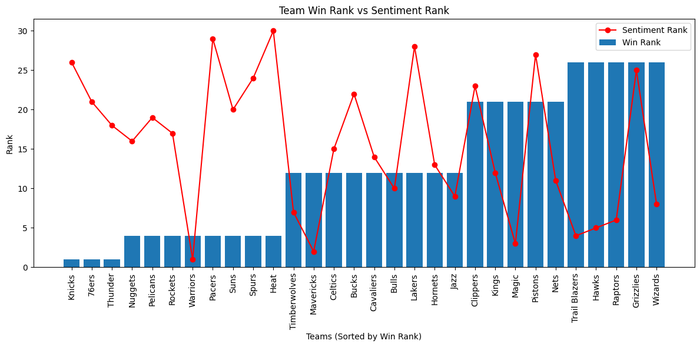
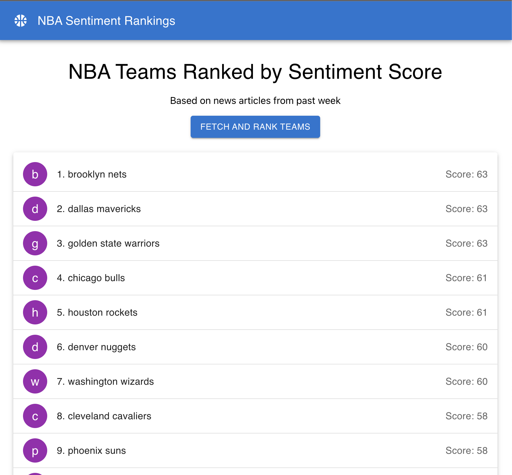

# NBA Sentiment Analysis App

This app fetches news articles about NBA teams, analyzes sentiment, and serves a sentiment score to the front end using newsapi, and NLTK vader.
Further data was created with the pre-trained distilbert model using transformers. 

